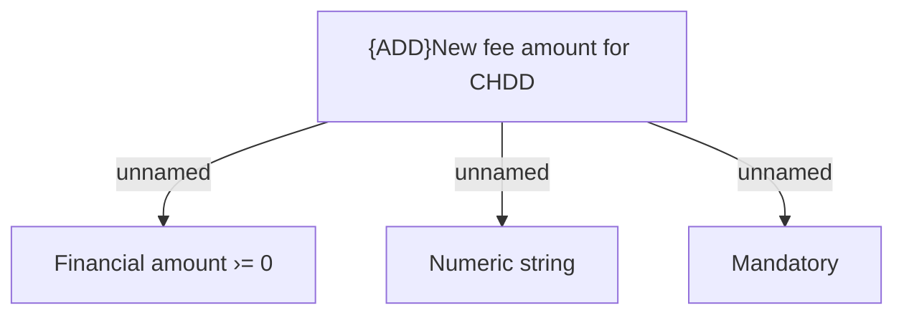

# Validation rules

- **Diagram Type**: Custom
- **Package**: HomerSelect/BSL/Analysis Model/Contract Management/Loan Service Processing/Loan Option CEL/Change of Due Date on request/Validation rules
- **Diagram ID**: 73106
- **Elements**: 4
- **Connectors**: 3

