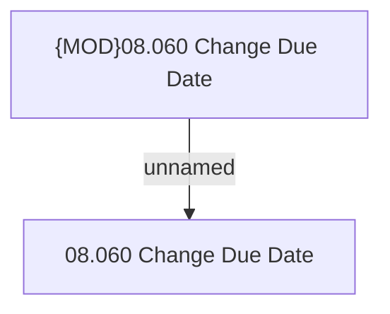

# Access Rights

- **Diagram Type**: Custom
- **Package**: HomerSelect/BSL/Analysis Model/Contract Management/Loan Service Processing/Loan Option CEL/Change of Due Date/Access Rights
- **Diagram ID**: 73074
- **Elements**: 2
- **Connectors**: 1

