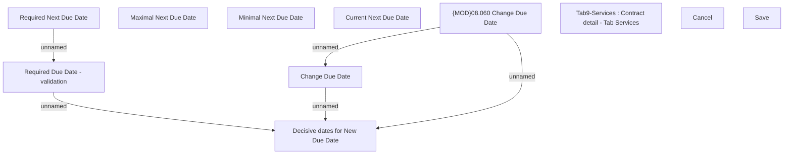

# Change Due Date

```mermaid
graph TD
    Decisive_dates_for_New_Due_Date["Decisive dates for New Due Date"]
    Required_Due_Date_validation["Required Due Date - validation"]
    Required_Next_Due_Date["Required Next Due Date"]
    Maximal_Next_Due_Date["Maximal Next Due Date"]
    Minimal_Next_Due_Date["Minimal Next Due Date"]
    Current_Next_Due_Date["Current Next Due Date"]
    MOD_08_060_Change_Due_Date["{MOD}08.060 Change Due Date"]
    Tab9_Services_Contract_detail_Tab_Services["Tab9-Services : Contract detail - Tab Services"]
    Cancel["Cancel"]
    Save["Save"]
    Change_Due_Date["Change Due Date"]
    Required_Next_Due_Date -->|unnamed| Required_Due_Date_validation
    Change_Due_Date -->|unnamed| Decisive_dates_for_New_Due_Date
    Required_Due_Date_validation -->|unnamed| Decisive_dates_for_New_Due_Date
    MOD_08_060_Change_Due_Date -->|unnamed| Change_Due_Date
    MOD_08_060_Change_Due_Date -->|unnamed| Decisive_dates_for_New_Due_Date
```
