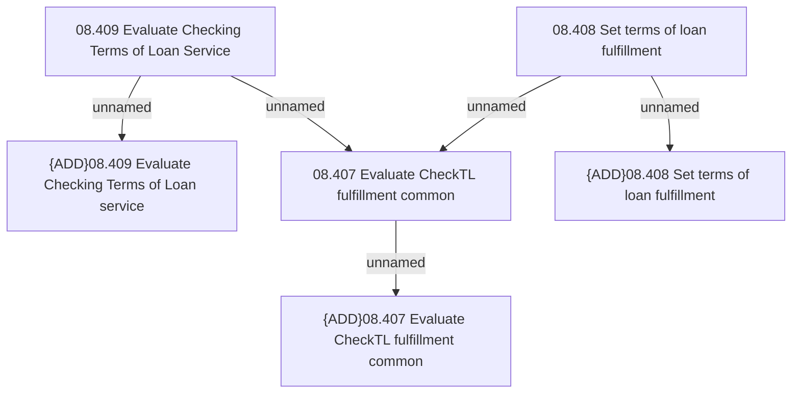

# Access Rights

```mermaid
graph TD
    n_08_407_Evaluate_CheckTL_fulfillment_common["08.407 Evaluate CheckTL fulfillment common"]
    ADD_08_407_Evaluate_CheckTL_fulfillment_common["{ADD}08.407 Evaluate CheckTL fulfillment common"]
    ADD_08_409_Evaluate_Checking_Terms_of_Loan_service["{ADD}08.409 Evaluate Checking Terms of Loan service"]
    n_08_409_Evaluate_Checking_Terms_of_Loan_Service["08.409 Evaluate Checking Terms of Loan Service"]
    ADD_08_408_Set_terms_of_loan_fulfillment["{ADD}08.408 Set terms of loan fulfillment"]
    n_08_408_Set_terms_of_loan_fulfillment["08.408 Set terms of loan fulfillment"]
    n_08_408_Set_terms_of_loan_fulfillment -->|unnamed| ADD_08_408_Set_terms_of_loan_fulfillment
    n_08_408_Set_terms_of_loan_fulfillment -->|unnamed| n_08_407_Evaluate_CheckTL_fulfillment_common
    n_08_409_Evaluate_Checking_Terms_of_Loan_Service -->|unnamed| n_08_407_Evaluate_CheckTL_fulfillment_common
    n_08_409_Evaluate_Checking_Terms_of_Loan_Service -->|unnamed| ADD_08_409_Evaluate_Checking_Terms_of_Loan_service
    n_08_407_Evaluate_CheckTL_fulfillment_common -->|unnamed| ADD_08_407_Evaluate_CheckTL_fulfillment_common
```
