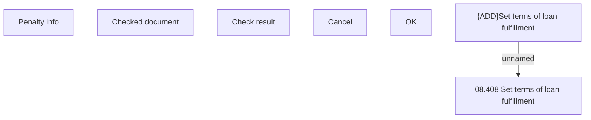

# Set terms of loan fulfillment

```mermaid
graph TD
    Penalty_info["Penalty info"]
    n_08_408_Set_terms_of_loan_fulfillment["08.408 Set terms of loan fulfillment"]
    Checked_document["Checked document"]
    Check_result["Check result"]
    Cancel["Cancel"]
    OK["OK"]
    ADD_Set_terms_of_loan_fulfillment["{ADD}Set terms of loan fulfillment"]
    ADD_Set_terms_of_loan_fulfillment -->|unnamed| n_08_408_Set_terms_of_loan_fulfillment
```
