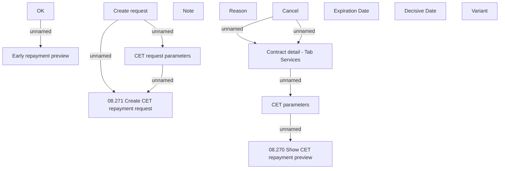

# CET Early repayment

```mermaid
graph TD
    Cancel["Cancel"]
    Create_request["Create request"]
    Early_repayment_preview["Early repayment preview"]
    Note["Note"]
    Reason["Reason"]
    Cancel["Cancel"]
    OK["OK"]
    Expiration_Date["Expiration Date"]
    n_08_270_Show_CET_repayment_preview["08.270 Show CET repayment preview"]
    n_08_271_Create_CET_repayment_request["08.271 Create CET repayment request"]
    Decisive_Date["Decisive Date"]
    Cancel["Cancel"]
    OK["OK"]
    Variant["Variant"]
    CET_parameters["CET parameters"]
    Contract_detail_Tab_Services["Contract detail - Tab Services"]
    CET_request_parameters["CET request parameters"]
    Create_request -->|unnamed| CET_request_parameters
    Cancel -->|unnamed| Contract_detail_Tab_Services
    Cancel -->|unnamed| Contract_detail_Tab_Services
    Contract_detail_Tab_Services -->|unnamed| CET_parameters
    Create_request -->|unnamed| n_08_271_Create_CET_repayment_request
    CET_request_parameters -->|unnamed| n_08_271_Create_CET_repayment_request
    CET_parameters -->|unnamed| n_08_270_Show_CET_repayment_preview
    OK -->|unnamed| Early_repayment_preview
```
