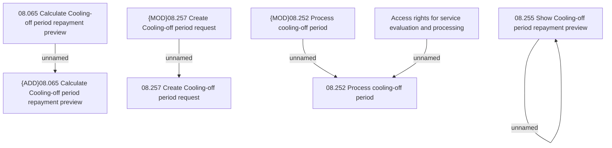

# Access Rights

- **Diagram Type**: Custom
- **Package**: HomerSelect/BSL/Analysis Model/Contract Management/Loan Service Processing/Loan Option CEL/Cooling-off period/Access Rights
- **Diagram ID**: 146226
- **Elements**: 9
- **Connectors**: 5

