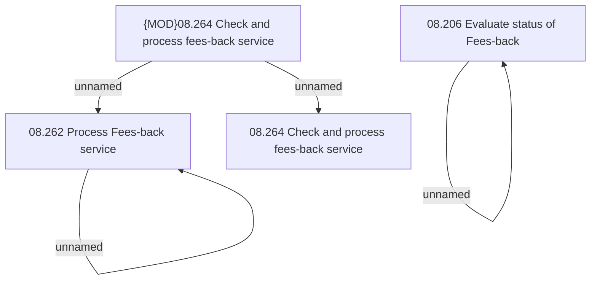

# Access Rigths

```mermaid
graph TD
    n_08_264_Check_and_process_fees_back_service["08.264 Check and process fees-back service"]
    MOD_08_264_Check_and_process_fees_back_service["{MOD}08.264 Check and process fees-back service"]
    n_08_262_Process_Fees_back_service["08.262 Process Fees-back service"]
    n_08_262_Process_Fees_back_service["08.262 Process Fees-back service"]
    n_08_206_Evaluate_status_of_Fees_back["08.206 Evaluate status of Fees-back"]
    n_08_206_Evaluate_status_of_Fees_back["08.206 Evaluate status of Fees-back"]
    MOD_08_264_Check_and_process_fees_back_service -->|unnamed| n_08_262_Process_Fees_back_service
    MOD_08_264_Check_and_process_fees_back_service -->|unnamed| n_08_264_Check_and_process_fees_back_service
    n_08_206_Evaluate_status_of_Fees_back -->|unnamed| n_08_206_Evaluate_status_of_Fees_back
    n_08_262_Process_Fees_back_service -->|unnamed| n_08_262_Process_Fees_back_service
```
