# Access Rights

- **Diagram Type**: Custom
- **Package**: HomerSelect/BSL/Analysis Model/Contract Management/Loan Service Processing/Loan Option CEL/Full Early Repayment/Access Rights
- **Diagram ID**: 164320
- **Elements**: 22
- **Connectors**: 14

```mermaid
graph TD
    n_08_067_Calculate_FER_on_virtual_IS["08.067 Calculate FER on virtual IS"]
    n_08_067_Calculate_FER_on_virtual_IS["08.067 Calculate FER on virtual IS"]
    ADD_08_041_Process_FER_automatically["{ADD}08.041 Process FER automatically"]
    n_08_041_Process_FER_automatically["08.041 Process FER automatically"]
    n_08_066_Calculate_Full_Early_repayment_preview["08.066 Calculate Full Early repayment preview"]
    n_08_066_Calculate_Full_Early_repayment_preview["08.066 Calculate Full Early repayment preview"]
    n_03_052_Create_Full_Early_repayment_request["03.052 Create Full Early repayment request"]
    n_03_052_Create_Full_Early_repayment_request["03.052 Create Full Early repayment request"]
    n_08_040_Select_contracts_for_FER_evaluation["08.040 Select contracts for FER evaluation"]
    n_08_040_Select_contracts_for_FER_evaluation["08.040 Select contracts for FER evaluation"]
    n_03_100_Check_and_process_Early_repayment_request["03.100 Check and process Early repayment  request"]
    n_03_100_Check_and_process_Early_repayment_request["03.100 Check and process Early repayment request"]
    n_03_110_Perform_early_repayment_installment_schedule["03.110 Perform early repayment installment schedule"]
    n_03_070_Calculate_early_repayment_amount["03.070 Calculate early repayment amount"]
    n_03_060_Calculate_early_repayment_date["03.060 Calculate early repayment date"]
    n_03_050_Create_Early_repayment_request_manually["03.050 Create Early repayment request manually"]
    n_03_035_Show_early_repayment_preview["03.035 Show early repayment preview"]
    MOD_03_110_Perform_early_repayment_installment_schedule["{MOD} 03.110 Perform early repayment installment schedule"]
    MOD_03_070_Calculate_early_repayment_amount["{MOD}03.070 Calculate early repayment amount"]
    MOD_03_060_Calculate_early_repayment_date["{MOD}03.060 Calculate early repayment date"]
    n_03_050_Create_Full_Early_repayment_request_manually["03.050 Create Full Early repayment request manually"]
    n_03_035_Show_early_repayment_preview["03.035 Show early repayment preview"]
    MOD_03_070_Calculate_early_repayment_amount -->|unnamed| n_03_070_Calculate_early_repayment_amount
    n_08_066_Calculate_Full_Early_repayment_preview -->|unnamed| n_08_066_Calculate_Full_Early_repayment_preview
    n_03_052_Create_Full_Early_repayment_request -->|unnamed| n_03_052_Create_Full_Early_repayment_request
    n_08_040_Select_contracts_for_FER_evaluation -->|unnamed| n_08_040_Select_contracts_for_FER_evaluation
    n_03_100_Check_and_process_Early_repayment_request -->|unnamed| n_03_100_Check_and_process_Early_repayment_request
    n_08_041_Process_FER_automatically -->|unnamed| n_03_100_Check_and_process_Early_repayment_request
    n_08_041_Process_FER_automatically -->|unnamed| ADD_08_041_Process_FER_automatically
    MOD_03_110_Perform_early_repayment_installment_schedule -->|unnamed| n_03_110_Perform_early_repayment_installment_schedule
    n_08_067_Calculate_FER_on_virtual_IS -->|External Reference| n_08_067_Calculate_FER_on_virtual_IS
    MOD_03_060_Calculate_early_repayment_date -->|unnamed| n_03_060_Calculate_early_repayment_date
    n_03_050_Create_Full_Early_repayment_request_manually -->|unnamed| n_03_050_Create_Early_repayment_request_manually
    n_03_035_Show_early_repayment_preview -->|unnamed| n_03_035_Show_early_repayment_preview
    n_03_050_Create_Full_Early_repayment_request_manually -->|unnamed| n_03_035_Show_early_repayment_preview
    n_08_040_Select_contracts_for_FER_evaluation -->|unnamed| n_03_100_Check_and_process_Early_repayment_request
```

