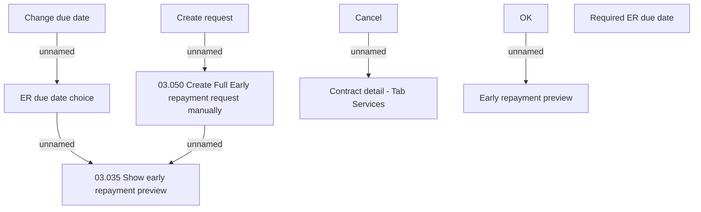

# Full Early Repayment

```mermaid
graph TD
    Change_due_date["Change due date"]
    Cancel["Cancel"]
    Create_request["Create request"]
    n_03_050_Create_Full_Early_repayment_request_manually["03.050 Create Full Early repayment request manually"]
    OK["OK"]
    Required_ER_due_date["Required ER due date"]
    ER_due_date_choice["ER due date choice"]
    Contract_detail_Tab_Services["Contract detail - Tab Services"]
    n_03_035_Show_early_repayment_preview["03.035 Show early repayment preview"]
    Early_repayment_preview["Early repayment preview"]
    OK -->|unnamed| Early_repayment_preview
    ER_due_date_choice -->|unnamed| n_03_035_Show_early_repayment_preview
    Create_request -->|unnamed| n_03_050_Create_Full_Early_repayment_request_manually
    Change_due_date -->|unnamed| ER_due_date_choice
    Cancel -->|unnamed| Contract_detail_Tab_Services
    n_03_050_Create_Full_Early_repayment_request_manually -->|unnamed| n_03_035_Show_early_repayment_preview
```
