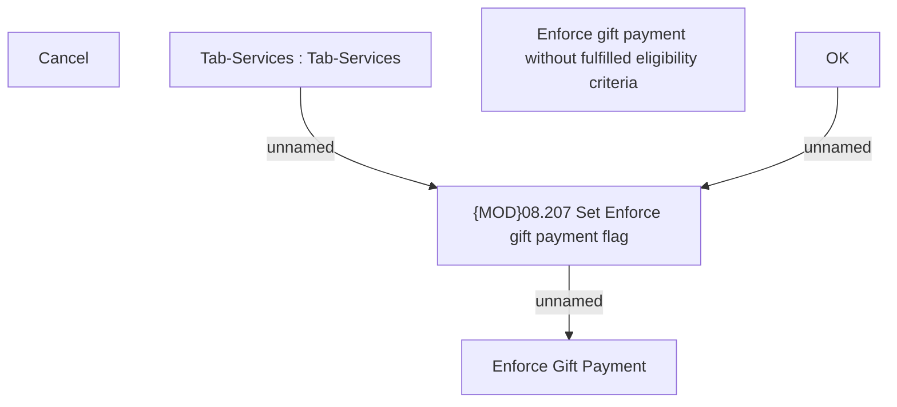

# {ADD}Gift Payment

```mermaid
graph TD
    Cancel["Cancel"]
    OK["OK"]
    Enforce_gift_payment_without_fulfilled_eligibility_criteria["Enforce gift payment without fulfilled eligibility criteria"]
    MOD_08_207_Set_Enforce_gift_payment_flag["{MOD}08.207 Set Enforce gift payment flag"]
    Tab_Services_Tab_Services["Tab-Services : Tab-Services"]
    Enforce_Gift_Payment["Enforce Gift Payment"]
    Tab_Services_Tab_Services -->|unnamed| MOD_08_207_Set_Enforce_gift_payment_flag
    OK -->|unnamed| MOD_08_207_Set_Enforce_gift_payment_flag
    MOD_08_207_Set_Enforce_gift_payment_flag -->|unnamed| Enforce_Gift_Payment
```
