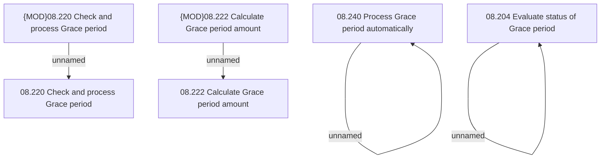

# Access Rights

```mermaid
graph TD
    n_08_240_Process_Grace_period_automatically["08.240 Process Grace period automatically"]
    n_08_240_Process_Grace_period_automatically["08.240 Process Grace period automatically"]
    n_08_220_Check_and_process_Grace_period["08.220 Check and process Grace period"]
    n_08_222_Calculate_Grace_period_amount["08.222 Calculate Grace period amount"]
    n_08_204_Evaluate_status_of_Grace_period["08.204 Evaluate status of Grace period"]
    MOD_08_220_Check_and_process_Grace_period["{MOD}08.220 Check and process Grace period"]
    MOD_08_222_Calculate_Grace_period_amount["{MOD}08.222 Calculate Grace period amount"]
    n_08_204_Evaluate_status_of_Grace_period["08.204 Evaluate status of Grace period"]
    MOD_08_222_Calculate_Grace_period_amount -->|unnamed| n_08_222_Calculate_Grace_period_amount
    n_08_240_Process_Grace_period_automatically -->|unnamed| n_08_240_Process_Grace_period_automatically
    n_08_204_Evaluate_status_of_Grace_period -->|unnamed| n_08_204_Evaluate_status_of_Grace_period
    MOD_08_220_Check_and_process_Grace_period -->|unnamed| n_08_220_Check_and_process_Grace_period
```
