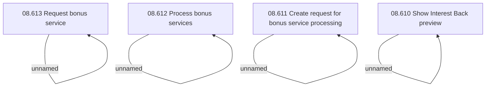

# Interest Back

```mermaid
graph TD
    n_08_613_Request_bonus_service["08.613 Request bonus service"]
    n_08_613_Request_bonus_service["08.613 Request bonus service"]
    n_08_612_Process_bonus_services["08.612 Process bonus services"]
    n_08_612_Process_bonus_services["08.612 Process bonus services"]
    n_08_611_Create_request_for_bonus_service_processing["08.611 Create request for bonus service processing"]
    n_08_611_Create_request_for_bonus_service_processing["08.611 Create request for bonus service processing"]
    n_08_610_Show_Interest_Back_preview["08.610 Show Interest Back preview"]
    n_08_610_Show_Interest_Back_preview["08.610 Show Interest Back preview"]
    n_08_613_Request_bonus_service -->|unnamed| n_08_613_Request_bonus_service
    n_08_611_Create_request_for_bonus_service_processing -->|unnamed| n_08_611_Create_request_for_bonus_service_processing
    n_08_612_Process_bonus_services -->|unnamed| n_08_612_Process_bonus_services
    n_08_610_Show_Interest_Back_preview -->|unnamed| n_08_610_Show_Interest_Back_preview
```
