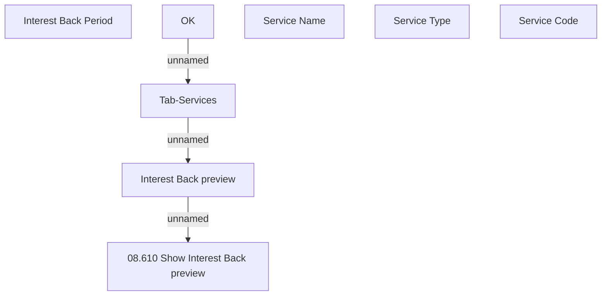

# Interest Back preview

```mermaid
graph TD
    Interest_Back_Period["Interest Back Period"]
    Tab_Services["Tab-Services"]
    OK["OK"]
    Service_Name["Service Name
"]
    Service_Type["Service Type"]
    Service_Code["Service Code"]
    n_08_610_Show_Interest_Back_preview["08.610 Show Interest Back preview"]
    Interest_Back_preview["Interest Back preview"]
    OK -->|unnamed| Tab_Services
    Interest_Back_preview -->|unnamed| n_08_610_Show_Interest_Back_preview
    Tab_Services -->|unnamed| Interest_Back_preview
```
