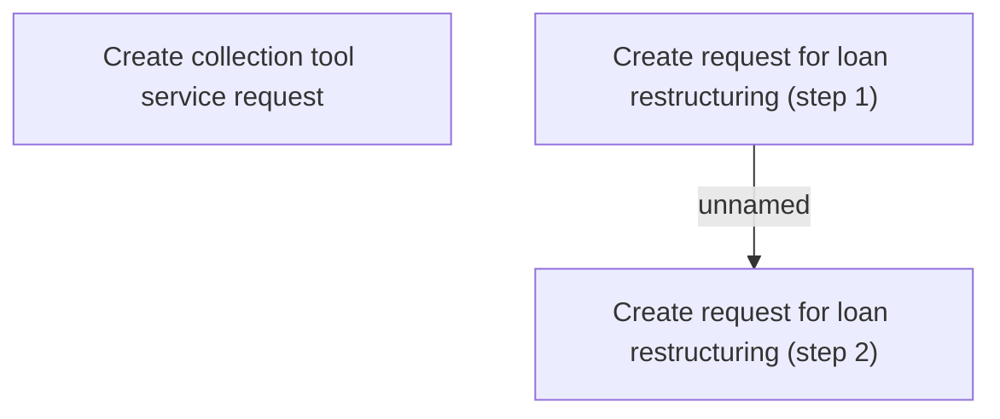

# Create request for loan restructuring (overview)

```mermaid
graph TD
    Create_collection_tool_service_request["Create collection tool service request"]
    Create_request_for_loan_restructuring_step_1["Create request for loan restructuring (step 1)"]
    Create_request_for_loan_restructuring_step_2["Create request for loan restructuring (step 2)"]
    Create_request_for_loan_restructuring_step_1 -->|unnamed| Create_request_for_loan_restructuring_step_2
```
