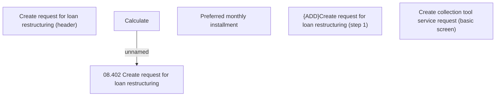

# Create request for loan restructuring (step 1)

- **Diagram Type**: Custom
- **Package**: HomerSelect/BSL/Analysis Model/Contract Management/Loan Service Processing/Loan Option CEL/Loan Restructuring/User Interface Model/Create request for loan restructuring (step 1)
- **Diagram ID**: 85879
- **Elements**: 6
- **Connectors**: 1

