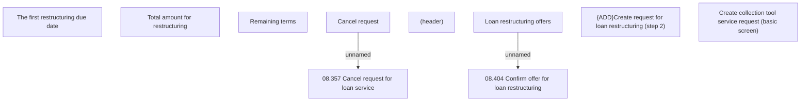

# Create request for loan restructuring (step 2)

```mermaid
graph TD
    n_08_357_Cancel_request_for_loan_service["08.357 Cancel request for loan service"]
    The_first_restructuring_due_date["The first restructuring due date"]
    Total_amount_for_restructuring["Total amount for restructuring"]
    Remaining_terms["Remaining terms"]
    n_08_404_Confirm_offer_for_loan_restructuring["08.404 Confirm offer for loan restructuring"]
    Cancel_request["Cancel request"]
    header["(header)"]
    Loan_restructuring_offers["Loan restructuring offers"]
    ADD_Create_request_for_loan_restructuring_step_2["{ADD}Create request for loan restructuring (step 2)"]
    Create_collection_tool_service_request_basic_screen["Create collection tool service request (basic screen)"]
    Loan_restructuring_offers -->|unnamed| n_08_404_Confirm_offer_for_loan_restructuring
    Cancel_request -->|unnamed| n_08_357_Cancel_request_for_loan_service
```
