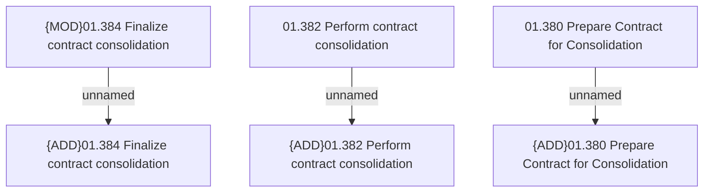

# Access Rights

- **Diagram Type**: Custom
- **Package**: HomerSelect/BSL/Analysis Model/Contract Management/Loan Service Processing/Loan Option CEL/Loan consolidation/Access Rights
- **Diagram ID**: 146231
- **Elements**: 6
- **Connectors**: 3

