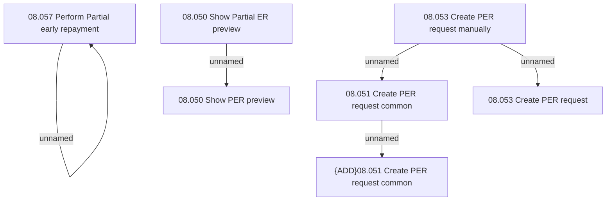

# Access Rights

```mermaid
graph TD
    ADD_08_051_Create_PER_request_common["{ADD}08.051 Create PER request common"]
    n_08_051_Create_PER_request_common["08.051 Create PER request common"]
    n_08_057_Perform_Partial_early_repayment["08.057 Perform Partial early repayment"]
    n_08_057_Perform_Partial_early_repayment["08.057 Perform Partial early repayment"]
    n_08_053_Create_PER_request["08.053 Create PER request"]
    n_08_053_Create_PER_request_manually["08.053 Create PER request manually"]
    n_08_050_Show_Partial_ER_preview["08.050 Show Partial ER preview"]
    n_08_050_Show_PER_preview["08.050 Show PER preview"]
    n_08_053_Create_PER_request_manually -->|unnamed| n_08_051_Create_PER_request_common
    n_08_053_Create_PER_request_manually -->|unnamed| n_08_053_Create_PER_request
    n_08_051_Create_PER_request_common -->|unnamed| ADD_08_051_Create_PER_request_common
    n_08_057_Perform_Partial_early_repayment -->|unnamed| n_08_057_Perform_Partial_early_repayment
    n_08_050_Show_Partial_ER_preview -->|unnamed| n_08_050_Show_PER_preview
```
