# Partial early repayment preview

- **Diagram Type**: Custom
- **Package**: HomerSelect/BSL/Analysis Model/Contract Management/Loan Service Processing/Loan Option CEL/Partial Early Repayment/User Interface Model/Partial early repayment preview
- **Diagram ID**: 125147
- **Elements**: 22
- **Connectors**: 1

```mermaid
graph TD
    PER_Maximal_Amount["PER Maximal Amount"]
    PER_Minimal_Amount["PER Minimal Amount"]
    Maximal_amount["Maximal amount:"]
    Minimal_amount["Minimal amount:"]
    Calculate["Calculate"]
    Partial_early_repayment_result["Partial early repayment result"]
    PER_Grid_Row_Item["PER Grid Row Item"]
    Lower_monthly_payment["Lower monthly payment"]
    Shorter_term["Shorter term"]
    vline1["vline1"]
    Client_repayment["Client repayment"]
    PER_due_date["PER due date"]
    Contract_date["Contract date"]
    Contract_number["Contract number"]
    Recommended_date_of_payment["Recommended date of payment"]
    Conditions_for_PER_fulfilled["Conditions for PER fulfilled"]
    Client_s_full_name["Client's full name"]
    Cancel["Cancel"]
    Notification_area["Notification area"]
    Create_request["Create request"]
    PER_type_choice["PER type choice"]
    Partial_early_repayment_preview["Partial early repayment preview"]
    Partial_early_repayment_result -->|unnamed| PER_Grid_Row_Item
```

