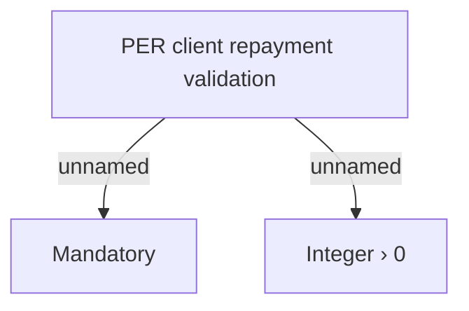

# Validations

- **Diagram Type**: Custom
- **Package**: HomerSelect/BSL/Analysis Model/Contract Management/Loan Service Processing/Loan Option CEL/Partial Early Repayment/Validations
- **Diagram ID**: 57147
- **Elements**: 3
- **Connectors**: 2

