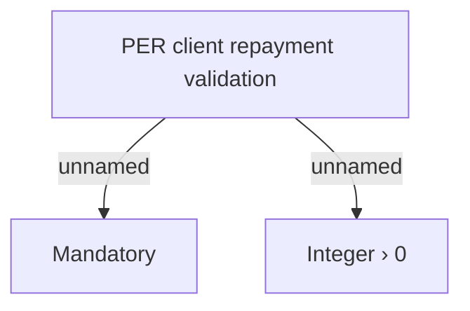

# Validations

```mermaid
graph TD
    Integer_0["Integer › 0"]
    Mandatory["Mandatory"]
    PER_client_repayment_validation["PER client repayment validation"]
    PER_client_repayment_validation -->|unnamed| Mandatory
    PER_client_repayment_validation -->|unnamed| Integer_0
```
