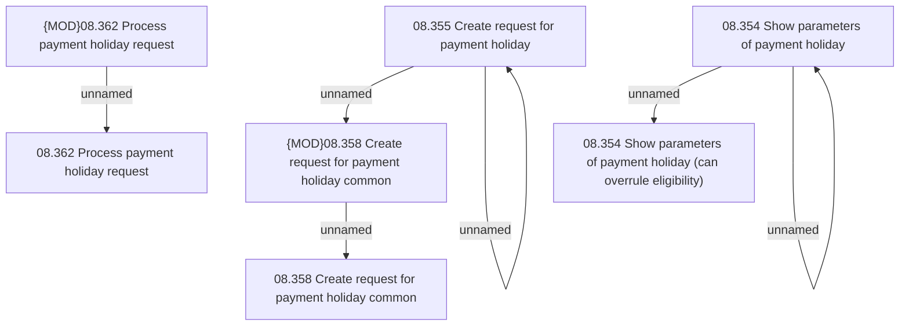

# Access Rights

- **Diagram Type**: Custom
- **Package**: HomerSelect/BSL/Analysis Model/Contract Management/Loan Service Processing/Loan Option CEL/Payment Holidays/Access Rights
- **Diagram ID**: 136476
- **Elements**: 9
- **Connectors**: 6

