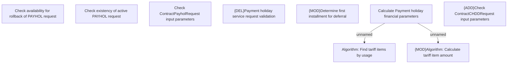

# Business Rules

- **Diagram Type**: Custom
- **Package**: HomerSelect/BSL/Analysis Model/Contract Management/Loan Service Processing/Loan Option CEL/Payment Holidays/Business Rules
- **Diagram ID**: 137566
- **Elements**: 9
- **Connectors**: 2

