# Create request for Payment holiday

- **Diagram Type**: Custom
- **Package**: HomerSelect/BSL/Analysis Model/Contract Management/Loan Service Processing/Loan Option CEL/Payment Holidays/User Interface Model/Create request for Payment holiday
- **Diagram ID**: 79328
- **Elements**: 15
- **Connectors**: 2

```mermaid
graph TD
    Contract_code["Contract code"]
    n_08_354_Show_parameters_of_payment_holiday["08.354 Show parameters of payment holiday"]
    Term_after_deferral["Term after deferral"]
    First_standard_due_date_installment_after_deferral["First standard due date installment after deferral"]
    Charged_fee_per_a_period["Charged fee per a period"]
    n_08_355_Create_request_for_payment_holiday["08.355 Create request for payment holiday"]
    Cancel["Cancel"]
    Create_request["Create request"]
    Presented_interest_rate_after_deferral["Presented interest rate after deferral"]
    Expected_last_due_date["Expected last due date"]
    Total_of_fees_charged["Total of fees charged"]
    Number_of_deferral_periods["Number of deferral periods"]
    Available_installment_for_deferral["Available installment for deferral"]
    Calculated_results["Calculated results"]
    Create_request_for_Payment_holiday["Create request for Payment holiday"]
    Create_request_for_Payment_holiday -->|unnamed| n_08_354_Show_parameters_of_payment_holiday
    Create_request -->|unnamed| n_08_355_Create_request_for_payment_holiday
```

