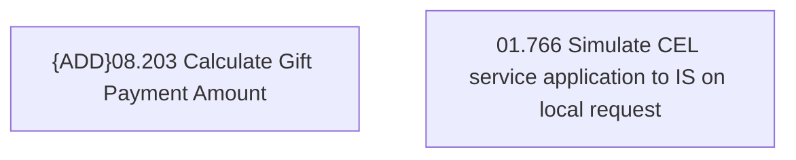

# Access rights

- **Diagram Type**: Custom
- **Package**: HomerSelect/BSL/Analysis Model/Contract Management/Loan Service Processing/Loan Option CEL/{ADD}Common for CEL loan options/Access rights
- **Diagram ID**: 100284
- **Elements**: 2
- **Connectors**: 0

