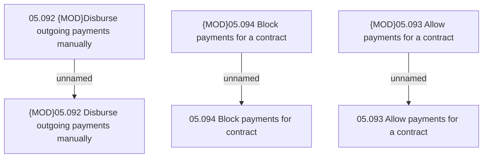

# Access rights

- **Diagram Type**: Custom
- **Package**: HomerSelect/BSL/Analysis Model/Contract Management/Outgoing payments operations on contract/Access rights
- **Diagram ID**: 95910
- **Elements**: 6
- **Connectors**: 3

