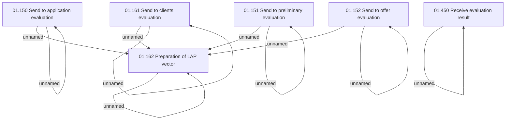

# Access rights

```mermaid
graph TD
    n_01_162_Preparation_of_LAP_vector["01.162 Preparation of LAP vector"]
    n_01_450_Receive_evaluation_result["01.450 Receive evaluation result"]
    n_01_161_Send_to_clients_evaluation["01.161 Send to clients evaluation"]
    n_01_161_Send_to_clients_evaluation["01.161 Send to clients evaluation"]
    n_01_152_Send_to_offer_evaluation["01.152 Send to offer evaluation"]
    n_01_151_Send_to_preliminary_evaluation["01.151 Send to preliminary evaluation"]
    n_01_150_Send_to_application_evaluation["01.150 Send to application evaluation"]
    n_01_162_Preparation_of_LAP_vector["01.162 Preparation of LAP vector"]
    n_01_450_Receive_evaluation_result["01.450 Receive evaluation result"]
    n_01_150_Send_to_application_evaluation["01.150 Send to application evaluation"]
    n_01_152_Send_to_offer_evaluation["01.152 Send to offer evaluation"]
    n_01_151_Send_to_preliminary_evaluation["01.151 Send to preliminary evaluation"]
    n_01_161_Send_to_clients_evaluation -->|unnamed| n_01_162_Preparation_of_LAP_vector
    n_01_152_Send_to_offer_evaluation -->|unnamed| n_01_162_Preparation_of_LAP_vector
    n_01_151_Send_to_preliminary_evaluation -->|unnamed| n_01_162_Preparation_of_LAP_vector
    n_01_162_Preparation_of_LAP_vector -->|unnamed| n_01_162_Preparation_of_LAP_vector
    n_01_150_Send_to_application_evaluation -->|unnamed| n_01_162_Preparation_of_LAP_vector
    n_01_150_Send_to_application_evaluation -->|unnamed| n_01_150_Send_to_application_evaluation
    n_01_161_Send_to_clients_evaluation -->|unnamed| n_01_161_Send_to_clients_evaluation
    n_01_151_Send_to_preliminary_evaluation -->|unnamed| n_01_151_Send_to_preliminary_evaluation
    n_01_450_Receive_evaluation_result -->|unnamed| n_01_450_Receive_evaluation_result
    n_01_152_Send_to_offer_evaluation -->|unnamed| n_01_152_Send_to_offer_evaluation
```
