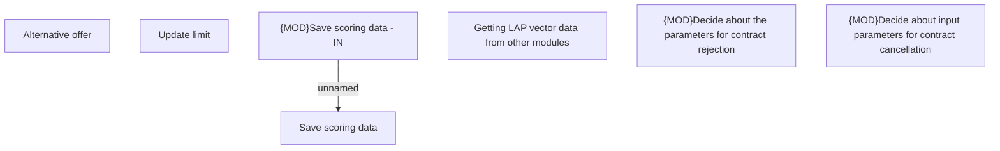

# Business Rules

```mermaid
graph TD
    Alternative_offer["Alternative offer"]
    Update_limit["Update limit"]
    MOD_Save_scoring_data_IN["{MOD}Save scoring data - IN"]
    Getting_LAP_vector_data_from_other_modules["Getting LAP vector data from other modules"]
    Save_scoring_data["Save scoring data"]
    MOD_Decide_about_the_parameters_for_contract_rejection["{MOD}Decide about the parameters for contract rejection"]
    MOD_Decide_about_input_parameters_for_contract_cancellation["{MOD}Decide about input parameters for contract cancellation"]
    MOD_Save_scoring_data_IN -->|unnamed| Save_scoring_data
```
