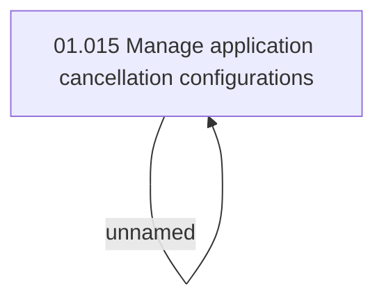

# Access rights

- **Diagram Type**: Custom
- **Package**: HomerSelect/BSL/Analysis Model/Contract Origination/Application cancellation configuration/Access rights
- **Diagram ID**: 134627
- **Elements**: 2
- **Connectors**: 1

