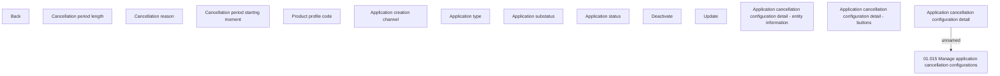

# Application cancellation configuration detail

```mermaid
graph TD
    n_01_015_Manage_application_cancellation_configurations["01.015 Manage application cancellation configurations"]
    Back["Back"]
    Cancellation_period_length["Cancellation period length"]
    Cancellation_reason["Cancellation reason"]
    Cancellation_period_starting_moment["Cancellation period starting moment"]
    Product_profile_code["Product profile code"]
    Application_creation_channel["Application creation channel"]
    Application_type["Application type"]
    Application_substatus["Application substatus"]
    Application_status["Application status"]
    Deactivate["Deactivate"]
    Update["Update"]
    Application_cancellation_configuration_detail_entity_informa["Application cancellation configuration detail - entity information"]
    Application_cancellation_configuration_detail_buttons["Application cancellation configuration detail - buttons"]
    Application_cancellation_configuration_detail["Application cancellation configuration detail"]
    Application_cancellation_configuration_detail -->|unnamed| n_01_015_Manage_application_cancellation_configurations
```
