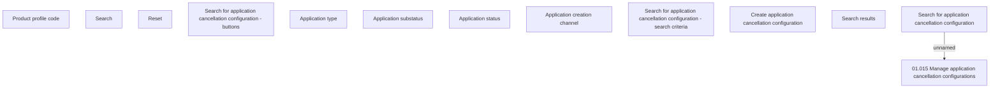

# Search for application cancellation configuration

```mermaid
graph TD
    n_01_015_Manage_application_cancellation_configurations["01.015 Manage application cancellation configurations"]
    Product_profile_code["Product profile code"]
    Search["Search"]
    Reset["Reset"]
    Search_for_application_cancellation_configuration_buttons["Search for application cancellation configuration - buttons"]
    Application_type["Application type"]
    Application_substatus["Application substatus"]
    Application_status["Application status"]
    Application_creation_channel["Application creation channel"]
    Search_for_application_cancellation_configuration_search_cri["Search for application cancellation configuration - search criteria"]
    Create_application_cancellation_configuration["Create application cancellation configuration"]
    Search_results["Search results"]
    Search_for_application_cancellation_configuration["Search for application cancellation configuration"]
    Search_for_application_cancellation_configuration -->|unnamed| n_01_015_Manage_application_cancellation_configurations
```
