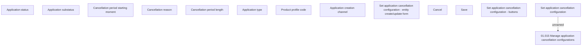

# Set application cancellation configuration

```mermaid
graph TD
    n_01_015_Manage_application_cancellation_configurations["01.015 Manage application cancellation configurations"]
    Application_status["Application status"]
    Application_substatus["Application substatus"]
    Cancellation_period_starting_moment["Cancellation period starting moment"]
    Cancellation_reason["Cancellation reason"]
    Cancellation_period_length["Cancellation period length"]
    Application_type["Application type"]
    Product_profile_code["Product profile code"]
    Application_creation_channel["Application creation channel"]
    Set_application_cancellation_configuration_entity_create_upd["Set application cancellation configuration - entity create/update form"]
    Cancel["Cancel"]
    Save["Save"]
    Set_application_cancellation_configuration_buttons["Set application cancellation configuration - buttons"]
    Set_application_cancellation_configuration["Set application cancellation configuration"]
    Set_application_cancellation_configuration -->|unnamed| n_01_015_Manage_application_cancellation_configurations
```
