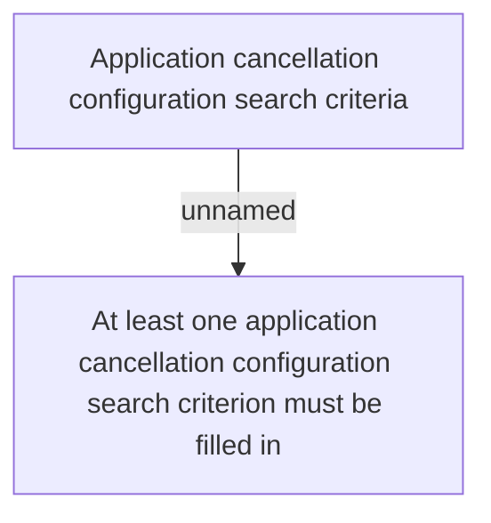

# Validation rules

- **Diagram Type**: Custom
- **Package**: HomerSelect/BSL/Analysis Model/Contract Origination/Application cancellation configuration/Validation rules
- **Diagram ID**: 134632
- **Elements**: 2
- **Connectors**: 1

