# Access Rights

- **Diagram Type**: Custom
- **Package**: HomerSelect/BSL/Analysis Model/Contract Origination/Application detail/Access Rights/Application documents
- **Diagram ID**: 149826
- **Elements**: 10
- **Connectors**: 8

```mermaid
graph TD
    n_20_127_Take_and_upload_contract_document_photo_all_salesro["20.127 Take and upload contract document photo (all salesrooms)"]
    n_20_127_Take_and_upload_contract_document_photo["20.127 Take and upload contract document photo"]
    n_20_127_Take_and_upload_contract_document_photo["20.127 Take and upload contract document photo"]
    n_20_125_Upload_document_all_salesrooms["20.125 Upload document (all salesrooms)"]
    n_20_125_Upload_document_all_statuses["20.125 Upload document (all statuses)"]
    n_20_125_Upload_document_status_Rejected["20.125 Upload document (status Rejected)"]
    n_20_125_Upload_document_status_Canceled["20.125 Upload document (status Canceled)"]
    n_20_125_Upload_document_statuses_before_signing["20.125 Upload document (statuses before signing)"]
    n_20_125_Upload_document["20.125 Upload document"]
    n_20_125_Upload_application_document["20.125 Upload application document"]
    n_20_127_Take_and_upload_contract_document_photo -->|unnamed| n_20_127_Take_and_upload_contract_document_photo_all_salesro
    n_20_127_Take_and_upload_contract_document_photo -->|unnamed| n_20_127_Take_and_upload_contract_document_photo
    n_20_125_Upload_application_document -->|unnamed| n_20_125_Upload_document_statuses_before_signing
    n_20_125_Upload_application_document -->|unnamed| n_20_125_Upload_document_all_salesrooms
    n_20_125_Upload_application_document -->|unnamed| n_20_125_Upload_document
    n_20_125_Upload_application_document -->|unnamed| n_20_125_Upload_document_all_statuses
    n_20_125_Upload_application_document -->|unnamed| n_20_125_Upload_document_status_Rejected
    n_20_125_Upload_application_document -->|unnamed| n_20_125_Upload_document_status_Canceled
```

