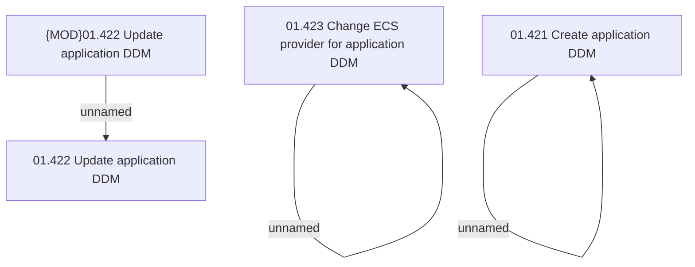

# Access Rights

- **Diagram Type**: Custom
- **Package**: HomerSelect/BSL/Analysis Model/Contract Origination/Application detail/Access Rights/Direct debit mandates
- **Diagram ID**: 158049
- **Elements**: 6
- **Connectors**: 3

