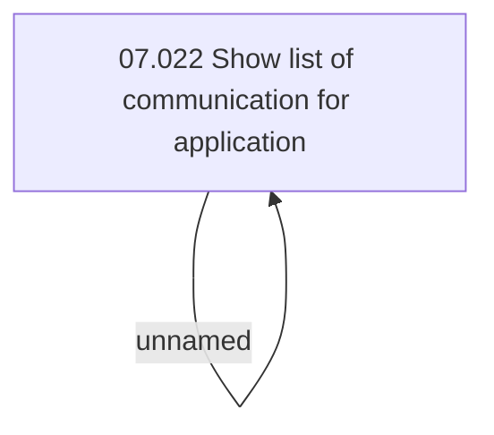

# Access Rights

- **Diagram Type**: Custom
- **Package**: HomerSelect/BSL/Analysis Model/Contract Origination/Application detail/Access Rights/List of communication
- **Diagram ID**: 149832
- **Elements**: 2
- **Connectors**: 1

