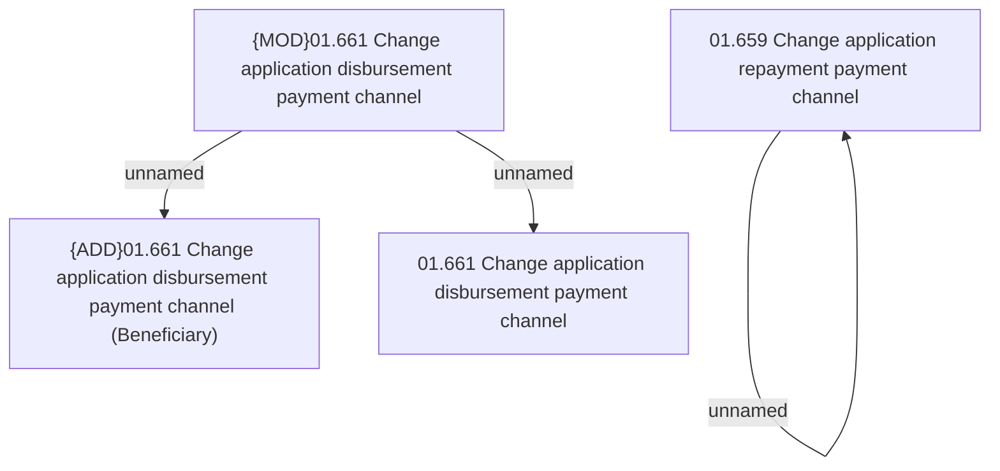

# Access Rights

- **Diagram Type**: Custom
- **Package**: HomerSelect/BSL/Analysis Model/Contract Origination/Application detail/Access Rights/Payment channels
- **Diagram ID**: 159619
- **Elements**: 5
- **Connectors**: 3

