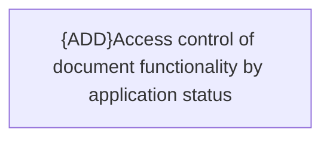

# Business Rules

- **Diagram Type**: Custom
- **Package**: HomerSelect/BSL/Analysis Model/Contract Origination/Application detail/Business Rules
- **Diagram ID**: 151011
- **Elements**: 1
- **Connectors**: 0

