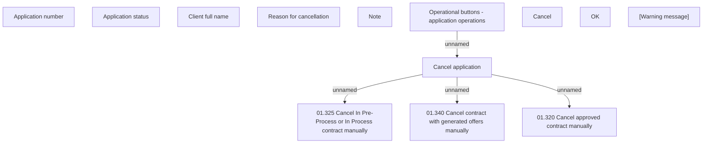

# Cancel application

```mermaid
graph TD
    n_01_320_Cancel_approved_contract_manually["01.320 Cancel approved contract manually"]
    n_01_340_Cancel_contract_with_generated_offers_manually["01.340 Cancel contract with generated offers manually"]
    n_01_325_Cancel_In_Pre_Process_or_In_Process_contract_manual["01.325 Cancel In Pre-Process or In Process contract manually"]
    Application_number["Application number"]
    Application_status["Application status"]
    Client_full_name["Client full name"]
    Reason_for_cancellation["Reason for cancellation"]
    Note["Note"]
    Cancel_application["Cancel application"]
    Operational_buttons_application_operations["Operational buttons - application operations"]
    Cancel["Cancel"]
    OK["OK"]
    Warning_message["[Warning message]"]
    Cancel_application["Cancel application"]
    Operational_buttons_application_operations -->|unnamed| Cancel_application
    Cancel_application -->|unnamed| n_01_325_Cancel_In_Pre_Process_or_In_Process_contract_manual
    Cancel_application -->|unnamed| n_01_340_Cancel_contract_with_generated_offers_manually
    Cancel_application -->|unnamed| n_01_320_Cancel_approved_contract_manually
```
