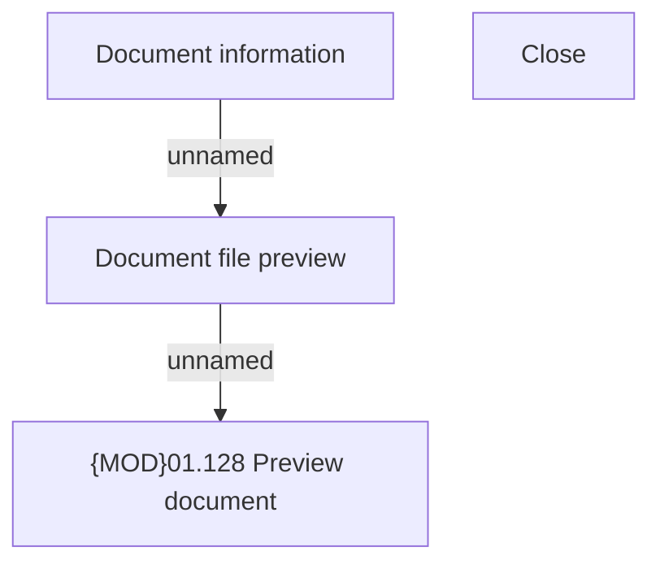

# Document file preview

- **Diagram Type**: Custom
- **Package**: HomerSelect/BSL/Analysis Model/Contract Origination/Application detail/COMMON for Application detail/User Interface Model/Document file preview (modal window)
- **Diagram ID**: 129938
- **Elements**: 5
- **Connectors**: 2

