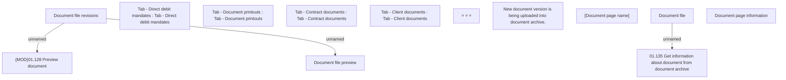

# Document page information

```mermaid
graph TD
    Document_file_preview["Document file preview"]
    Document_file_revisions["Document file revisions"]
    Tab_Direct_debit_mandates_Tab_Direct_debit_mandates["Tab - Direct debit mandates : Tab - Direct debit mandates"]
    Tab_Document_printouts_Tab_Document_printouts["Tab - Document printouts : Tab - Document printouts"]
    Tab_Contract_documents_Tab_Contract_documents["Tab - Contract documents : Tab - Contract documents"]
    Tab_Client_documents_Tab_Client_documents["Tab - Client documents : Tab - Client documents"]
    n_["˅ ˅ ˅"]
    New_document_version_is_being_uploaded_into_document_archive["New document version is being uploaded into document archive."]
    Document_page_name["[Document page name]"]
    Document_file["Document file"]
    MOD_01_128_Preview_document["{MOD}01.128 Preview document"]
    n_01_135_Get_information_about_document_from_document_archiv["01.135 Get information about document from document archive"]
    Document_page_information["Document page information"]
    Document_file -->|unnamed| n_01_135_Get_information_about_document_from_document_archiv
    Document_file_revisions -->|unnamed| MOD_01_128_Preview_document
    Document_file_revisions -->|unnamed| Document_file_preview
```
