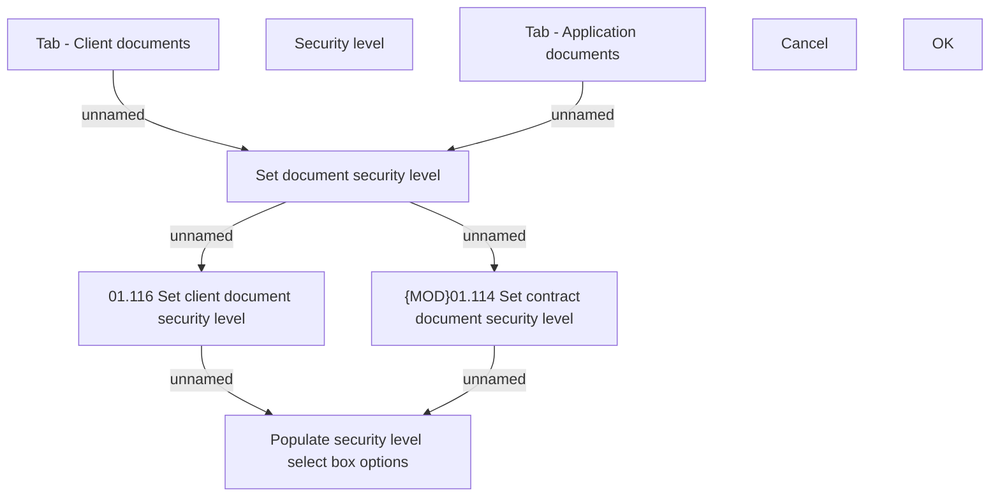

# Set document security level

```mermaid
graph TD
    Tab_Application_documents["Tab - Application documents"]
    Security_level["Security level"]
    Set_document_security_level["Set document security level"]
    Tab_Client_documents["Tab - Client documents"]
    Populate_security_level_select_box_options["Populate security level select box options"]
    n_01_116_Set_client_document_security_level["01.116 Set client document security level"]
    Cancel["Cancel"]
    OK["OK"]
    MOD_01_114_Set_contract_document_security_level["{MOD}01.114 Set contract document security level"]
    Set_document_security_level["Set document security level"]
    Tab_Client_documents -->|unnamed| Set_document_security_level
    Tab_Application_documents -->|unnamed| Set_document_security_level
    Set_document_security_level -->|unnamed| MOD_01_114_Set_contract_document_security_level
    Set_document_security_level -->|unnamed| n_01_116_Set_client_document_security_level
    n_01_116_Set_client_document_security_level -->|unnamed| Populate_security_level_select_box_options
    MOD_01_114_Set_contract_document_security_level -->|unnamed| Populate_security_level_select_box_options
```
