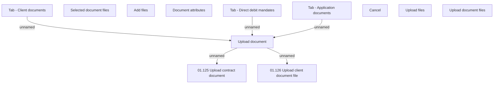

# Upload document

```mermaid
graph TD
    Tab_Application_documents["Tab - Application documents"]
    Selected_document_files["Selected document files"]
    Add_files["Add files"]
    Document_attributes["Document attributes"]
    Tab_Direct_debit_mandates["Tab - Direct debit mandates"]
    Tab_Client_documents["Tab - Client documents"]
    n_01_126_Upload_client_document_file["01.126 Upload client document file"]
    n_01_125_Upload_contract_document["01.125 Upload contract document"]
    Cancel["Cancel"]
    Upload_files["Upload files"]
    Upload_document_files["Upload document files"]
    Upload_document["Upload document"]
    Tab_Client_documents -->|unnamed| Upload_document
    Tab_Direct_debit_mandates -->|unnamed| Upload_document
    Tab_Application_documents -->|unnamed| Upload_document
    Upload_document -->|unnamed| n_01_125_Upload_contract_document
    Upload_document -->|unnamed| n_01_126_Upload_client_document_file
```
