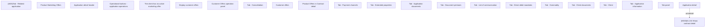

# Application detail

```mermaid
graph TD
    ADD_Tab_Related_application["{ADD}Tab - Related application"]
    Product_Marketing_Offers["Product Marketing Offers"]
    MOD_01_210_Show_contract_detail["{MOD}01.210 Show contract detail"]
    Application_detail_header["Application detail header"]
    Operational_buttons_application_operations["Operational buttons - application operations"]
    The_client_has_no_active_marketing_offer["The client has no active marketing offer."]
    Display_customer_offers["Display customer offers"]
    Customer_Offers_operation_panel["Customer Offers operation panel"]
    Tab_Consolidation["Tab - Consolidation"]
    Customer_offers["Customer offers"]
    Product_Offers_in_Contract_detail["Product Offers in Contract detail"]
    Tab_Payment_channels["Tab - Payment channels"]
    Tab_Extended_properties["Tab - Extended properties"]
    Tab_Application_documents["Tab - Application documents"]
    Tab_Document_printouts["Tab - Document printouts"]
    Tab_List_of_communication["Tab - List of communication"]
    Tab_Direct_debit_mandates["Tab - Direct debit mandates"]
    Tab_Commodity["Tab - Commodity"]
    Tab_Client_documents["Tab - Client documents"]
    Tab_Client["Tab - Client"]
    Tab_Application_information["Tab - Application information"]
    Tab_panel["Tab panel"]
    Application_detail["Application detail"]
    Application_detail -->|unnamed| MOD_01_210_Show_contract_detail
```
