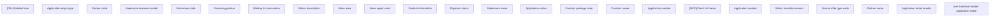

# Application detail header

```mermaid
graph TD
    DEL_Related_loan["{DEL}Related loan"]
    Application_origin_type["Application origin type"]
    Partner_code["Partner code"]
    Salesroom_business_model["Salesroom business model"]
    Salesroom_code["Salesroom code"]
    Financing_partner["Financing partner"]
    Waiting_for_termination["Waiting for termination"]
    Status_description["Status description"]
    Sales_area["Sales area"]
    Sales_agent_code["Sales agent code"]
    Product_information["Product information"]
    Payment_status["Payment status"]
    Salesroom_name["Salesroom name"]
    Application_status["Application status"]
    Contract_package_code["Contract package code"]
    Contract_owner["Contract owner"]
    Application_number["Application number"]
    MOD_Client_full_name["{MOD}Client full name"]
    Application_created["Application created"]
    Status_transition_reason["Status transition reason"]
    Source_offer_type_code["Source offer type code"]
    Partner_name["Partner name"]
    Application_detail_header["Application detail header"]
    User_Interface_Model_Application_detail["User Interface Model : Application detail"]
```
