# Operational buttons - application operations

- **Diagram Type**: Custom
- **Package**: HomerSelect/BSL/Analysis Model/Contract Origination/Application detail/User Interface Model/Operational buttons - application operations (panel)
- **Diagram ID**: 163629
- **Elements**: 50
- **Connectors**: 29

```mermaid
graph TD
    Cancel_application["Cancel application"]
    Manage_Marketing_Offers["Manage Marketing Offers"]
    User_Interface_Model_Application_detail["User Interface Model : Application detail"]
    n_01_910_Change_Client_on_Contract_v2["01.910 Change Client on Contract v2"]
    External_Reference["External Reference"]
    MOD_05_094_Block_payments_for_a_contract["{MOD}05.094 Block payments for a contract"]
    MOD_01_159_Reject_offer["{MOD}01.159 Reject offer"]
    MOD_Change_client["{MOD}Change client"]
    el_1871769["Text"]
    OK["OK"]
    Cancel["Cancel"]
    Do_you_really_want_to_refuse_all_new_offers["Do you really want to refuse all new offers?"]
    n_01_163_Perform_Lenddo_verification["01.163 Perform Lenddo verification"]
    Contract_signing_multiple_sign["Contract signing - multiple sign"]
    Lenddo_verification["Lenddo verification"]
    Release_contract["Release contract"]
    Choose_product_offer["Choose product offer"]
    Application_form["Application form"]
    Add_to_contract_package["Add to contract package"]
    DEL_02_906_Marketing_Offers_Management["{DEL}02.906 Marketing Offers Management"]
    Change_client_on_contract["Change client on contract"]
    Send_to_evaluation["Send to evaluation"]
    Reprint_AF_submit_document["Reprint AF submit document"]
    Refuse_new_offers["Refuse new offers"]
    MOD_05_093_Allow_payments_for_a_contract["{MOD}05.093 Allow payments for a contract"]
    Block_payments["Block payments"]
    Allow_payments["Allow payments"]
    Select_product["Select product"]
    Postpone_decision["Postpone decision"]
    n_01_031_Release_assigned_contract["01.031 Release assigned contract"]
    Release_application["Release application"]
    n_01_083_Fill_in_application_2BoD["01.083 Fill in application - 2BoD"]
    Fill_in_application_2BoD["Fill in application (2BoD)"]
    n_01_180_Sign_contract_manually["01.180 Sign contract manually"]
    Sign_contract["Sign contract"]
    Inform_client["Inform client"]
    Remove_from_package["Remove from package"]
    Cancel_application["Cancel application"]
    Refresh_evaluation["Refresh evaluation"]
    Add_to_package["Add to package"]
    n_01_154_Postpone_decision_about_optional_offers["01.154 Postpone decision about optional offers"]
    Operational_buttons_application_operations["Operational buttons - application operations"]
    n_01_010_Choose_product_offer["01.010 Choose product offer"]
    n_01_200_Add_to_contract_package["01.200 Add to contract package"]
    n_01_305_Inform_client["01.305 Inform client"]
    n_01_240_Remove_from_contract_package["01.240 Remove from contract package"]
    n_01_320_Cancel_approved_contract_manually["01.320 Cancel approved contract manually"]
    n_01_340_Cancel_contract_with_generated_offers_manually["01.340 Cancel contract with generated offers manually"]
    n_01_325_Cancel_In_Pre_Process_or_In_Process_contract_manual["01.325 Cancel In Pre-Process or In Process contract manually"]
    n_01_080_Fill_in_application["01.080 Fill in application"]
    Allow_payments -->|unnamed| MOD_05_093_Allow_payments_for_a_contract
    MOD_Change_client -->|unnamed| n_01_910_Change_Client_on_Contract_v2
    Reprint_AF_submit_document -->|unnamed| External_Reference
    Block_payments -->|unnamed| MOD_05_094_Block_payments_for_a_contract
    Refuse_new_offers -->|unnamed| MOD_01_159_Reject_offer
    Refuse_new_offers -->|unnamed| Do_you_really_want_to_refuse_all_new_offers
    Lenddo_verification -->|unnamed| n_01_163_Perform_Lenddo_verification
    Sign_contract -->|unnamed| Contract_signing_multiple_sign
    Release_application -->|unnamed| Release_contract
    Select_product -->|unnamed| Choose_product_offer
    Fill_in_application_2BoD -->|unnamed| Application_form
    Add_to_package -->|unnamed| Add_to_contract_package
    Manage_Marketing_Offers -->|unnamed| DEL_02_906_Marketing_Offers_Management
    Cancel_application -->|unnamed| Cancel_application
    DEL_02_906_Marketing_Offers_Management -->|unnamed| n_01_010_Choose_product_offer
    Send_to_evaluation -->|unnamed| n_01_080_Fill_in_application
    Cancel_application -->|unnamed| n_01_325_Cancel_In_Pre_Process_or_In_Process_contract_manual
    Cancel_application -->|unnamed| n_01_340_Cancel_contract_with_generated_offers_manually
    Cancel_application -->|unnamed| n_01_320_Cancel_approved_contract_manually
    Remove_from_package -->|unnamed| n_01_240_Remove_from_contract_package
    Add_to_package -->|unnamed| n_01_200_Add_to_contract_package
    MOD_Change_client -->|unnamed| Change_client_on_contract
    Select_product -->|unnamed| n_01_010_Choose_product_offer
    Postpone_decision -->|unnamed| n_01_154_Postpone_decision_about_optional_offers
    Sign_contract -->|unnamed| n_01_180_Sign_contract_manually
    Fill_in_application_2BoD -->|unnamed| n_01_083_Fill_in_application_2BoD
    Release_application -->|unnamed| n_01_031_Release_assigned_contract
    n_01_083_Fill_in_application_2BoD -->|unnamed| n_01_080_Fill_in_application
    Inform_client -->|unnamed| n_01_305_Inform_client
```

