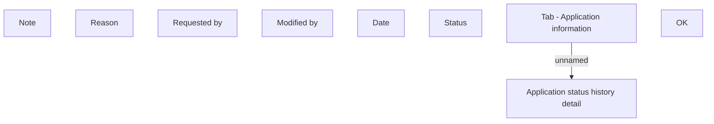

# Application status history detail

- **Diagram Type**: Custom
- **Package**: HomerSelect/BSL/Analysis Model/Contract Origination/Application detail/User Interface Model/Tab - Application information/Application status history detail (modal window)
- **Diagram ID**: 133306
- **Elements**: 10
- **Connectors**: 1

