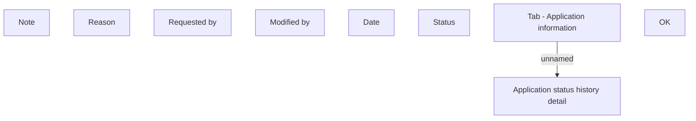

# Application status history detail

```mermaid
graph TD
    Note["Note"]
    Reason["Reason"]
    Requested_by["Requested by"]
    Modified_by["Modified by"]
    Date["Date"]
    Status["Status"]
    Application_status_history_detail["Application status history detail"]
    Tab_Application_information["Tab - Application information"]
    OK["OK"]
    Application_status_history_detail["Application status history detail"]
    Tab_Application_information -->|unnamed| Application_status_history_detail
```
