# Tab - Application information

- **Diagram Type**: Custom
- **Package**: HomerSelect/BSL/Analysis Model/Contract Origination/Application detail/User Interface Model/Tab - Application information
- **Diagram ID**: 141211
- **Elements**: 17
- **Connectors**: 2

```mermaid
graph TD
    Reference_application_number["Reference application number"]
    User_Interface_Model_Application_detail["User Interface Model : Application detail"]
    Lead_ID["Lead ID"]
    Application_status_requests["Application status requests"]
    Translate_of_business_event_attribute["Translate of business event attribute"]
    Application_events["Application events"]
    Application_status_history_detail["Application status history detail"]
    Comment["Comment"]
    Salesman["Salesman"]
    Business_events["Business events"]
    Date_sent_to_evaluation["Date sent to evaluation"]
    Send_to_identification["Send to identification"]
    Date_of_last_change["Date of last change"]
    Prepared_to_sign["Prepared to sign"]
    Application_events["Application events"]
    Application_status_history["Application status history"]
    Tab_Application_information["Tab - Application information"]
    Application_status_history -->|unnamed| Application_status_history_detail
    Business_events -->|unnamed| Translate_of_business_event_attribute
```

